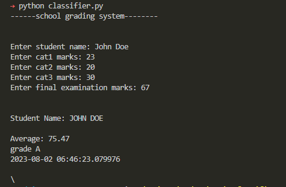

classifier.py

The program accepts user inputs from the keyboard
i.e(name, cat1,cat2,cat3, final examination)

The program also computes:
        Their sum and average
        Current datetime
        Grade acquired

